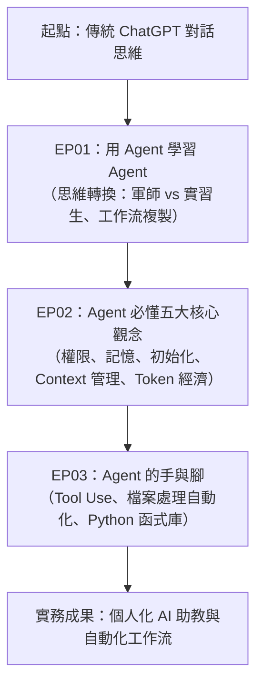

# AI Agent 基本功教學 — 課程總覽與學習地圖

> 本專案為教師對學生教學 **AI Agent（人工智慧代理人）基本觀念** 的專用教材與實作範例庫。  
> 教學內容主要參考並歸納自教育創新推廣者 **「三師爸」（Sense Bar，宋睿偉老師）** 的 YouTube 經典教學系列：《AI Agent 基本功》。

---

## 🎯 課程教學目標

1. **破除迷思**：理解「雲端對話式 AI」與「本機 AI Agent」的根本差異，建立「給 AI 手與腳」的現代工作流思維。
2. **掌握核心觀念**：搞懂 Agent 運作五大基石 —— 權限控制、記憶機制（全域 vs 專案）、初始化架構、上下文管理（避免越聊越笨）、模型分級與用量經濟學。
3. **具備實作能力**：學會透過自然語言指揮 Agent 操作電腦檔案（Word、Excel、PPT、PDF）、自動安裝工具與相依環境、抓取網路資料，解決真實世界與教學現場的繁雜工作。
4. **養成專業習慣**：學會使用開放標準 `agents.md` 藍圖與 `handoff.md` 建立具備延續性、跨工具、跨工作階段的標準工作流。

---

## 🗺️ 課程章節與單元規劃

### 單元詳細索引

| 單元編號 | 單元主題 | 核心概念 | 參考影片 | 對應講義 |
|:---|:---|:---|:---|:---|
| **EP01** | 用 Agent 學習 Agent | 雲端 AI vs 本機 Agent、手腳比喻、GitHub 工作流導入 | [YouTube 觀看](https://www.youtube.com/watch?v=3s2Q1nViZ1w) | [`EP01_用Agent學習Agent與工作流思維.md`](file:///Users/liangzuwei/Library/CloudStorage/GoogleDrive-spawnkiller1003@gmail.com/我的雲端硬碟/14_Antigravity2專案用/AI%20agent基本功教學專案/course_materials/EP01_用Agent學習Agent與工作流思維.md) |
| **EP02** | 核心五大觀念與初始化 | 權限邊界、全域 vs 專案記憶、Context 視窗防呆、Token 分級 | [YouTube 觀看](https://www.youtube.com/watch?v=8nwjYouFJoE) | [`EP02_核心五大觀念與初始化設定.md`](file:///Users/liangzuwei/Library/CloudStorage/GoogleDrive-spawnkiller1003@gmail.com/我的雲端硬碟/14_Antigravity2專案用/AI%20agent基本功教學專案/course_materials/EP02_核心五大觀念與初始化設定.md) |
| **EP03** | Agent 的手腳與自動化實戰 | 工具呼叫（Tool Use）、檔案批次處理、自動安裝環境、Office 自動化 | [YouTube 觀看](https://www.youtube.com/watch?v=b8YgyYGjJEU) | [`EP03_Agent的手腳與自動化實戰.md`](file:///Users/liangzuwei/Library/CloudStorage/GoogleDrive-spawnkiller1003@gmail.com/我的雲端硬碟/14_Antigravity2專案用/AI%20agent基本功教學專案/course_materials/EP03_Agent的手腳與自動化實戰.md) |
| **速查指南** | 學生重點小抄與核心問答 | 觀念精華、常見疑惑解答、指令範例與踩坑防範 | 彙整總結 | [`Agent觀念速查表_學生指南.md`](file:///Users/liangzuwei/Library/CloudStorage/GoogleDrive-spawnkiller1003@gmail.com/我的雲端硬碟/14_Antigravity2專案用/AI%20agent基本功教學專案/course_materials/Agent觀念速查表_學生指南.md) |

---

## 💡 教師授課指引與學生引導建議

1. **教學切入點（第一堂課）**：
   - 先問學生：「大家平常怎麼用 ChatGPT 或 Claude？」通常回答都是在網頁上問問題、複製貼上回答。
   - 示範一段用 AI Agent 直接在終端機整理學生作業或批次重命名 100 個檔案的過程，讓學生第一眼感受到震撼與差異。
2. **避免陷入程式恐懼**：
   - 強調「你不需要是資深工程師，才能用 Agent」。重點在於 **表達清晰的邏輯需求、設定邊界條件、學會檢查輸出**。
3. **隨時回顧 Context 與成本觀念**：
   - 很多初學者會覺得「AI 怎麼越做越笨、亂改東西」，這正是講授 EP02 Context Window 與交接機制（handoff）的最佳時機。
