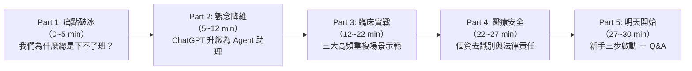

# 30分鐘演講大綱：從「動嘴」到「動手」— 專為醫師、PA 與 NP 打造的 AI Agent 臨床省力指南

> **演講時長**：30 分鐘（25 分鐘核心演講 ＋ 5 分鐘現場 Q&A）  
> **演講對象**：醫院主治醫師、住院醫師、醫師助理（PA）、專科護理師（NP）  
> **學員背景**：微接觸過 ChatGPT / 雲端 AI，但不熟悉程式與底層技術；臨床工作繁重，深受病歷、交班、報告、統計等重複性行政庶務所苦。  
> **核心目標**：讓臨床醫護人員在 30 分鐘內建立「AI Agent」概念，理解它與普通 ChatGPT 的本質差異，看見「替自己省下 1 小時行政時間」的實際場景，並掌握醫療安全與個資去識別化的必備觀念。

---

## ⏱️ 時間分配與架構地圖

---

## 📽️ 逐頁投影片設計與講稿規劃

### 投影片 1：封面與破題（0 ~ 2 min）
* **簡報標題**：從「動嘴」到「動手」：AI Agent 如何幫醫護奪回準時下班的權利？
* **副標題**：專為臨床醫師、PA 與 NP 打造的自動化省力工作流
* **視覺呈現**：左邊是一張被病摘、交班單、檢驗單淹沒的疲憊醫護插畫；右邊是一個清爽、有條理的數位助理正在批次處理表格。
* **講者開場口語（講稿要點）**：
  > 「各位醫師、PA 與 NP 夥伴大家午安。大家今天早上開了多少個臨床系統視窗？複製貼上了多少次檢驗報告？寫了多少份出院病摘？我們當初穿上白袍，是為了救治病人，但現實是，我們每天有超過 30% 到 40% 的時間，都在當『人肉資料搬運工』。今天這 30 分鐘，我不講複雜的程式碼，只講一件事情：怎麼讓現代的 AI Agent 替你長出『手和腳』，把繁瑣的雜事接過去，讓你準時下班。」

---

### 投影片 2：現實痛點 — 為什麼你用的 ChatGPT 常常「看得到吃不到」？（2 ~ 5 min）
* **簡報標題**：我們都試過 ChatGPT，但為什麼它沒能拯救你的臨床日常？
* **視覺呈現**：對比圖表
  * **網頁版 ChatGPT 的現實限制**：
    * ⚠️ 只能在瀏覽器打字（動嘴的軍師）
    * ⚠️ 碰不到你的電腦資料夾與 Excel
    * ⚠️ 你得手動把文字複製過去、再手動複製貼回系統
    * ⚠️ 遇到長篇對話容易胡說八道（幻覺）
* **講者口語要點**：
  > 「很多人問我：『我試過 ChatGPT 啊，好像只能幫忙寫寫信、修修英文文法，對我下午要交的 10 份交班報告有什麼用？我還是得自己一筆一筆複製貼上！』沒錯，因為傳統的聊天 AI 只有『大腦』，沒有『手腳』。它關在瀏覽器分頁裡，碰不到你的 Word、讀不到你的排班 Excel、也摸不到指引 PDF。最後，最累的依然是你這個『搬運工』。」

---

### 投影片 3：核心概念 — 什麼是 AI Agent？給大腦裝上「手與腳」（5 ~ 8 min）
* **簡報標題**：觀念升級：什麼是真正的「AI Agent」？
* **核心比喻**：
  * 傳統聊天 AI = **只會坐在會議室出主意的軍師**
  * AI Agent = **能坐在你隔壁、直接幫你操作電腦的資深實習助理**
* **視覺呈現**：
  * 流程圖：大腦思考（LLM） ➔ **工具手腳（Tool Use）**：
    1. 🦾 **讀取檔案**：直接讀取你丟進資料夾的 PDF、Word、Excel
    2. 🦾 **撰寫修改**：直接建立格式整齊的表格或病摘草稿
    3. 🦾 **執行指令**：自動跑批次腳本處理幾百個檔案
* **講者口語要點**：
  > 「Agent（智慧代理人）跟普通 ChatGPT 最大的不同，就在於它擁有『手和腳』。當你跟它說：『幫我整理這五份檢驗報告並抓出異常值』，它不是打一段字給你看，而是直接打開檔案、抓取數值、對照標準值、把異常標紅，然後產出一份你立刻能用的檔案。你不再是搬運工，你是審核主管！」

---

### 投影片 4：核心概念 — Agent 的三大基本運作邏輯（8 ~ 12 min）
* **簡報標題**：不必學程式，但必須懂的 3 個 Agent 底層規則
* **內容重點**：
  1. **權限邊界（安全第一）**：
     * 它每做一個危險動作（如覆蓋舊檔案），都會問你一聲，確認安全才執行。
  2. **專案手冊（給 AI 的說明書）**：
     * 我們可以給它一份範本說明（例如科內慣用的 SOAP 或 SBAR 格式），它每次做事都會嚴格遵守，不用每次重教。
  3. **上下文視窗（Context 防呆）**：
     * 為什麼 AI 越聊越笨？因為對話塞滿垃圾。一件事解決就開新對話，就像換一個乾淨的病歷夾，AI 才會保持最清醒的判斷力。
* **講者口語要點**：
  > 「跟實習醫師或新進 NP 交接時，我們會給他們『臨床常規手冊（Routine）』；跟 Agent 合作也是一樣。只要在資料夾裡放一份格式範本，它就會照著規矩辦事，既受控又精準。」

---

### 投影片 5：臨床實戰一 — 病歷彙整、交班與出院病摘初稿（12 ~ 15 min）
* **簡報標題**：場景一：病歷筆記與 SBAR 交班資訊秒整理
* **臨床情境**：
  * 住院病患住院兩週，累積了厚厚十幾天各科照會、檢驗數值與處置紀錄。
  * NP / PA 需要在 15 分鐘內擠出「出院病摘（Discharge Summary）」初稿。
* **Agent 操作示範**：
  * 指令：*「這是該病患去識別化後的入院紀錄與每日進展筆記。請依照我們科標準格式，整理出：1. 入院主訴 2. 住院期間主要處置時間軸 3. 目前穩定度與出院帶藥建議。」*
* **效益**：
  * 原本需翻閱 20 分鐘的病歷紀錄，Agent 在 20 秒內抓出時間軸與重大事件，醫護人員只需進行「醫學專業核對與簽章」。

---

### 投影片 6：臨床實戰二 — 科室繁瑣行政與 Excel 表格批次自動化（15 ~ 18 min）
* **簡報標題**：場景二：告別手動對照 — 班表、在職證明與教學評估統計
* **臨床情境**：
  * 月底排班對照、專任護理師考核時數統計、UGY/PGY 教學評量表彙整。
  * 手上有 3 個不同版本的 Excel，欄位順序甚至還不一樣。
* **Agent 操作示範**：
  * 指令：*「資料夾裡有三張不同月份的受訓簽到 Excel 表。請使用 Python 自動將三張表的姓名與受訓時數合併，剔除重複資料，並產出一份『時數未滿 20 小時之名單』存為新檔。」*
* **效益**：
  * 完全不需要自己寫複雜的 `VLOOKUP` 或 `COUNTIF` 公式，Agent 自動用 Python 幾秒內跑完統計。

---

### 投影片 7：臨床實戰三 — 最新臨床指引（Guidelines）與文獻速讀（18 ~ 22 min）
* **簡報標題**：場景三：面對 80 頁的最新指引，如何 1 分鐘抓出關鍵建議？
* **臨床情境**：
  * NEJM / ACC / ADA 剛發布最新指引，厚達數十頁英文 PDF。
  * 明早晨會要做 Case Conference，急需確認新藥物的適應症與第一線禁忌症。
* **Agent 操作示範**：
  * 指令：*「請閱讀這份 2026 ADA 最新糖尿病治療指引 PDF，直接定位到有關『CKD 第 3 期合併心衰竭』的章節，列出推薦用藥等級（Class of Recommendation）及對應頁碼。」*
* **效益**：
  * 不再靠 AI 憑空捏造，Agent 帶著「頁碼與引文」回覆，精準又具備可查證性。

---

### 投影片 8：醫療人員必備第一守則 — 個資去識別化與法律邊界（22 ~ 25 min）
* **簡報標題**：重要防線：醫療 AI 的安全、隱私與責任邊界
* **三不一要原則**：
  1. ❌ **名字不出現**：王小明 ➔ 男 / 62歲。
  2. ❌ **病歷號不出現**：Chart Number 一律抹除或改為虛擬代碼（Patient A）。
  3. ❌ **辨識特徵不出現**：身分證字號、聯絡電話、特殊職業背景一律過濾。
  4. ✅ **人類永遠握有最終審核權（Human-in-the-loop）**：
     * AI 寫的是「Draft（初稿）」，蓋章負責的是「具備證照的你」。
* **講者口語要點**：
  > 「各位夥伴請牢記：AI 是幫我們省時間的『數位手腳』，但不是扛責任的『主治醫師』。任何文字送入商業或雲端模型前，去識別化是保護病人，也是保護我們自己專業的第一道鐵律。」

---

### 投影片 9：總結 — 明天上班就能開始的「三步啟動法」（25 ~ 27 min）
* **簡報標題**：新手落地：明天上班，你可以嘗試的 3 個小步驟
* **視覺呈現**：階梯式圖解
  * **第一步【找一件痛點雜事】**：不要想一步登天改變全院系統；先找「每週都要做、超無聊的重複任務」（例如：整理晨會文獻重點、批次合併表格）。
  * **第二步【建立標準資料夾】**：在電腦裡建立專用資料夾，放進標準格式範本與說明檔（`agents.md`）。
  * **第三步【一句話請 Agent 動工】**：給目標、給限制、給範本，檢查成果後交接！
* **金句結語**：
  > 「科技不是要取代醫師或護理師的溫度，而是要幫我們把被電腦螢幕綁架的時間搶回來，還給病人、還給家人、還給我們自己。」

---

### 投影片 10：現場提問與交流（Q&A）（27 ~ 30 min）
* **簡報標題**：Q & A 與交流時間
* **常見現場提問預備題庫（FAQ）**：
  * **Q1：國軍醫院公務電腦「不可連網、不可插 USB 隨身碟、不可安裝第三方 App」，該怎麼辦？**  
    *實戰解法*：**雙軌工作流（私人筆電跑 Agent ＋ 合規資料傳輸）**
    1. **Agent 在自己的私人筆電上工作**：完全擺脫公務電腦的資安鎖定，享有完整 AI 運算與自動化套件支援。
    2. **資料安全擷取途徑**：
       - 從「行動雲端查房系統」直接於個人裝置擷取（務必先去識別化）。
       - 若資料在醫院公用電腦內網，則透過**公務 Email（寄信給自己）**或**院內合法雲端交換檔案**管道轉出至私人筆電。
    3. **成果傳回公用電腦**：Agent 完成結構化病摘、交班清單或統計後，**比照上述 Email 或雲端交換檔案管道傳回公用電腦**，直接貼回系統，合規又安全！
  * **Q2：如果 AI 產出的數字或劑量算錯了怎麼辦？**  
    *回答方向*：強調 Agent 必須附上原始數據出處，劑量計算必須有嚴謹的查驗（Double check）步驟，AI 產出絕不能不經閱讀就直接發布。

---

## 💡 講者教學技巧與互動建議

1. **破冰時使用臨床黑話（Jargon）**：
   - 適度使用「病摘」、「交班」、「SBAR」、「SOAP」、「照會」、「評鑑」，會讓台下的醫護同仁立刻覺得你「懂臨床痛點」，而不是單純來推銷技術的工程師。
2. **視覺避免出現大量程式碼**：
   - 投影片千萬不要放 Python 語法或終端機黑色視窗；改放「輸入檔案（混亂的病歷/表格）➔ 一鍵轉換 ➔ 輸出乾淨報表」的對比截圖，視覺衝擊力最強。
3. **強調「去識別化」安全感**：
   - 醫護人員對個資法與醫療糾紛極度敏感，在演講前半段就主動點出安全防線，能極大降低他們的排斥感與心理防備。
