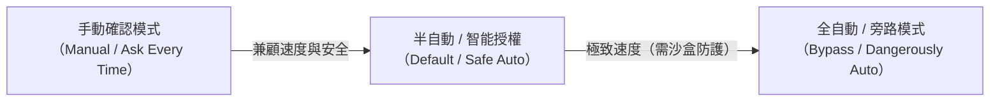
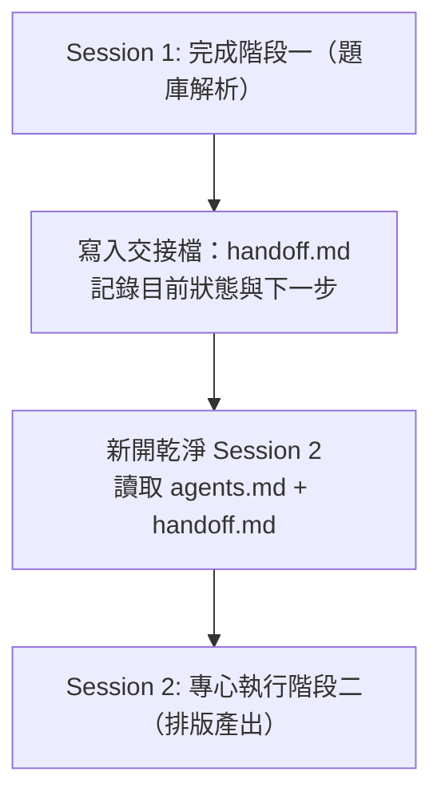

# EP02：核心五大觀念與專案初始化設定

> **參考影片**：三師爸《AI Agent 基本功 EP02》[點擊觀看 YouTube 影片](https://www.youtube.com/watch?v=8nwjYouFJoE)  
> **核心主題**：使用 Agent 前必懂的五大底層邏輯（權限、記憶、初始化、Context 防呆、用量經濟學）。

---

## 📖 核心觀念一：權限管理（Permission & 安全邊界）

Agent 具有執行指令與改寫檔案的「物理能力」，如果沒有安全控管，可能誤刪重要資料。主流 Agent（如 Claude Code, OpenCode, Codex, AntiGravity）通常提供三種權限模式：

1. **手動確認模式（Ask / Manual）**：
   - 每一次讀檔、改檔、執行終端機命令，Agent 都會跳出提問，等人類按 `y` 或 `Enter`。
   - **優點**：極致安全，完全掌控。
   - **缺點**：非常慢，無法離開座位讓它自動跑。
2. **半自動模式（Balanced，最推薦）**：
   - 安全的「唯讀動作」（如看檔案清單、搜尋文字）自動放行。
   - 涉及「修改檔案、終端機執行、網路存取」等動作才向人類請示。
3. **全自動 / Bypass 模式**：
   - 略過所有確認提問，Agent 一口氣執行到底。
   - **安全準則**：建議在有獨立沙盒（Sandbox）或有 Git 版本控制保護的專案中使用。

---

## 📖 核心觀念二：記憶配置（全域設定 vs 專案設定）

要讓 Agent 成為懂你的得力助手，必須區分「跨專案的個人偏好」與「單一專案的特定規則」：

| 記憶層級 | 存放位置範例 | 記載內容 | 適用情境 |
|:---|:---|:---|:---|
| **全域記憶 (Global)** | `~/.claude/` 或 使用者全域設定檔 | 「請一律使用繁體中文（台灣用語）」 「我的電腦是 Mac，預設 Shell 是 zsh」 | 換到任何專案都適用的個人習慣與環境規格 |
| **專案記憶 (Project)** | 專案根目錄的 `agents.md` 或 `CLAUDE.md` | 「本專案是給國中數學科段考題庫整理」 「所有產出考卷放 `exams/` 資料夾」 | 只有這個專案才需要的技術規格、資料結構與規範 |

> ⚠️ **避坑提醒**：  
> 切勿把專案專屬細節塞進全域設定（會干擾其他專案），也不要在每個專案重複設定共通的語系習慣。

---

## 📖 核心觀念三：專案初始化（Project Init）與 Git 基礎

開新專案時，養成「專案初始化」的習慣，就像建大樓先打地基：

1. **建立專案說明書（`agents.md`）**：
   - 讓任何 Agent 第一次進入資料夾時，立刻知道專案目標、現存檔案結構與限制。
2. **初始化版本控制（`git init`）**：
   - 替專案建立時光機。萬一 Agent 改壞了代碼或誤刪文字，可以用 `git checkout` 或 `git restore` 一鍵還原。
3. **設置 `.gitignore`**：
   - 告訴 Git 哪些檔案「不要納入追蹤」，例如作業系統暫存檔（`desktop.ini`、`.DS_Store`）、含密碼金鑰的環境變數檔（`.env`）。

---

## 📖 核心觀念四：上下文管理（Context Window）— 為什麼 AI 會越聊越笨？

許多人常遇到：「剛開始跟 AI 聊的時候很聰明，怎麼聊了三四十輪之後，它開始忘東忘西、答非所問、甚至推翻自己前面的設定？」

### 1. 什麼是 Context Window（上下文視窗）？
- AI 模型每次回答問題時，並不是真的「記住」過去，而是將這整段對話的所有歷史紀錄**從頭到尾重新讀一遍**。
- 這個一次能閱讀的上限容量，就是 Context Window。

### 2. 「越聊越笨」的根本原因：注意力漂移（Attention Drift）
- 長時間對話中，包含了大量的「嘗試錯誤」、「除錯代碼輸出」、「冗長的報錯日誌」。
- 當對話塞滿雜訊時，最初設定的關鍵目標（System Prompt）所佔的權重被大幅稀釋，AI 自然開始胡言亂語。

### 3. 解方：單一任務原則 ＋ 交接檔（`handoff.md`）

- **核心操作**：告別無止境的長對話！階段性任務完成後，請 Agent 將進度總結存入 `handoff.md`，然後**開新對話**接續工作。

---

## 📖 核心觀念五：用量經濟學與模型分級（Model Hierarchy）

在實際使用 AI Agent 時，每一次對話與工具呼叫都會消耗 Token（計費單位）。學會「依照任務難度指派對應等級的模型」，是兼顧速度、品質與荷包的關鍵：

| 模型分級 | 代表模型（以 Claude / OpenAI / Gemini 為例） | 專長領域 | 建議使用時機 |
|:---:|:---|:---|:---|
| **S 級（旗艦大腦）** | Claude 3.7 Sonnet (Thinking) / Opus / GPT-o3 | 複雜系統架構設計、困難除錯、長篇深入推理 | 專案初始化規劃、棘手難題突破 |
| **A 級（主力工兵）** | Claude 3.5 Sonnet / GPT-4o | 代碼撰寫、文件處理、邏輯清晰的中大型任務 | 日常主要開發、講義產生、大部分實作 |
| **B 級（輕量快手）** | Gemini 2.5 Flash / Claude 3.5 Haiku / GPT-4o-mini | 快速檢索、格式排版、語法檢查、大量資料篩選 | 批次讀取大量文字、單純的檔案更名、快速查問 |

---

## 🎯 學生課堂思考題（Q&A）

1. **問：我不想花太多 API 費用，該如何節省 Token？**  
   *答*：善用 Context 管理！不要在同一個對話中一直灌入大檔案；及時開新對話，並利用 B 級或 A 級模型處理日常工作，把 S 級模型留給關鍵規劃。

2. **問：如果不小心在 Bypass 模式下讓 Agent 把檔案覆蓋掉了，該怎麼辦？**  
   *答*：這就是為什麼要有 `git init`！只要事前有 commit 紀錄，終端機輸入 `git checkout -- .` 就能瞬間復原所有被修改的檔案。

---

## 🛠️ 本單元學生實踐小任務

- [ ] **任務一**：檢查自己專案根目錄下是否已有 `agents.md`，並閱讀裡面的規則約定。
- [ ] **任務二**：在專案中故意開新對話，請 Agent「讀取 `agents.md` 與 `handoff.md` 告訴我目前做到哪」，體驗無縫接續的威力。
