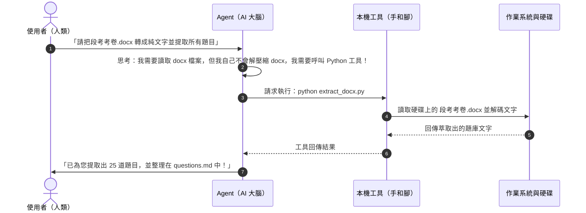

# EP03：Agent 的手與腳 — 工具呼叫、檔案處理與自動化實戰

> **參考影片**：三師爸《AI Agent 基本功 EP03》[點擊觀看 YouTube 影片](https://www.youtube.com/watch?v=b8YgyYGjJEU)  
> **核心主題**：揭秘 Agent 的手腳（Tool Use）、教 AI 自動安裝 Python 工具、一句話處理 Word/Excel/PPT/PDF 與上網抓資料。

---

## 📖 核心觀念：什麼是 Agent 的「手腳」？（Tool Use 解密）

在傳統的觀念中，大型語言模型（LLM）本質上只是一個「預測下一個文字機率」的超大型大腦，它本身**無法**連上網路，也**無法**讀取硬碟中的檔案。

那為什麼現在的 Agent 可以幫我們改檔案、跑程式呢？關鍵就在於 **工具呼叫（Tool Use / Function Calling）**：

---

## 🛠️ 教學與行政必備：Python 自動化四大天王

三師爸在 EP03 特別強調：**「初學者不用學寫 Python 程式碼，但要知道 Python 有哪些超好用的武器庫！」** 當你指揮 Agent 時，只要提到這些武器的名字，Agent 就會自己去呼叫：

| 檔案類型 | 推薦 Python 工具庫 | 典型應用場景 | 指揮 Agent 的範例句式 |
|:---|:---|:---|:---|
| **Word 講義 / 文件** | `python-docx` | 自動產出學習單、講義排版、替換全班姓名套印獎狀 | *「請用 python-docx 讀取這份模板，將名冊中的學生名字填入，各產出一份個人獎狀。」* |
| **Excel 成績 / 表格** | `openpyxl`, `pandas` | 成績常態分配計算、排名、缺交作業統計、多表合併 | *「請用 pandas 分析這份段考成績，計算班平均、標準差，並篩選不及格名單存成新表。」* |
| **PowerPoint 簡報** | `python-pptx` | 將 Markdown 課程大綱自動套用母片生成簡報 PPT | *「請依據 EP01 的教學重點，用 python-pptx 生成 5 頁乾淨結構的簡報投影片。」* |
| **PDF 考卷 / 論文** | `PyPDF2`, `pdfplumber` | PDF 分割合併、掃描考卷文字提取、表格萃取 | *「請把這份 20 頁的教學手冊，依照章節切分成獨立的 5 個 PDF 小檔。」* |
| **圖片 / 掃描檔辨識** | `pytesseract` / OCR / 多模態模型 | 翻拍考卷轉文字、黑板筆記轉數位文字 | *「請讀取這張段考手寫解答照片，透過 OCR 萃取所有算式與文字。」* |

---

## 💡 一句話讓 Agent 自行解決環境相依

在過去，初學者最常卡關的惡夢就是：
> `ModuleNotFoundError: No module named 'docx'` 或是 `pip command not found`

在現代 Agent 工作流中，你不必自己手忙腳亂開命令列敲 `pip install`：
- **正確心態**：直接對 Agent 說：*「請檢查處理這項任務需要的套件，如果環境裡沒有，請自行建立虛擬環境或安裝，再繼續執行。」*
- Agent 會自動偵測作業系統（Mac / Windows）、檢查 Python 版本、自動跑安裝命令，並在遇到版本衝突時自己嘗試其他替代方案。

---

## 🚀 實戰應用示範情境

### 情境 A：整理混亂的教學資料夾
- **痛苦痛點**：電腦桌面或下載資料夾塞滿了「未命名.docx」、「新建文件(1).xlsx」、「螢幕截圖 2026.png」。
- **一句話指令**：  
  > *「請檢視目前資料夾中的所有檔案，依照『簡報』、『講義』、『試算表』、『圖片』建立子資料夾，並根據檔案內容中的標題自動重新命名後歸位。」*

### 情境 B：聯網即時收集教學素材
- **痛苦痛點**：想要備課最新科技新聞或尋找國中數學素養題情境，需要手動開十幾個網頁瀏覽。
- **一句話指令**：  
  > *「請上網搜尋近期最新的 AI 代理人應用案例，挑選 3 個最適合國中生理解的有趣生活案例，整理成教學 Markdown 摘要，並附上來源網址。」*

---

## 🎯 學生課堂思考題（Q&A）

1. **問：讓 Agent 自動上網抓資料，會不會抓到假消息？**  
   *答*：有可能！這就是為什麼要求 Agent 在抓取資料時必須**附上來源網址（URL Citations）**。人類的職責是查驗來源可信度（例如是否來自官方新聞、權威網站），而非替它跑腿。

2. **問：Agent 寫的 Python 程式檔跑完後，還需要保留嗎？**  
   *答*：建議保留在專案的腳本資料夾（如 `scripts/`）！下一次有類似需求時，直接叫 Agent 複用既有腳本，不僅執行速度更快，還能節省重複生成代碼的 Token。

---

## 🛠️ 本單元學生實踐小任務

- [ ] **任務一**：請 Agent 寫一支簡單的 Python 小程式，在專案中自動建立一個包含「姓名、座號、成績」三欄的測試用 Excel 檔案。
- [ ] **任務二**：請 Agent 讀取該 Excel 檔案，計算出平均分數，並在終端機列印出來。
- [ ] **任務三**：請 Agent 嘗試使用網路搜尋功能，查出今年度最熱門的一款開源 AI 工具，並寫進 `ai_news.md`。
